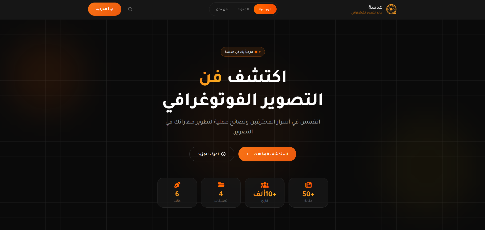

# عدسة | منصة عربية للتصوير الفوتوغرافي

عدسة هي منصة عربية مخصّصة لعشّاق التصوير الفوتوغرافي، تجمع بين المعرفة، الإلهام، والتجربة العملية لمساعدة المصورين على تطوير أسلوبهم وبناء عين فنية واعية.

---

## لمحة عن الواجهة

واجهة عدسة مصممة بأسلوب داكن أنيق مع لمسات برتقالية دافئة تعكس أجواء الإبداع، وتوفّر تجربة تصفح سلسة ومريحة سواء على الحاسوب أو الجوال.

---

## ماذا يقدّم الموقع؟

### الصفحة الرئيسية
- تعريف سريع بهوية عدسة
- إبراز المقالات المختارة
- عرض أحدث المواضيع المنشورة

### قسم المدونة
- مقالات تعليمية وإلهامية مرتبة
- إمكانية البحث والتصفية حسب التصنيفات:
  - الإضاءة
  - البورتريه
  - المناظر الطبيعية
  - التقنيات
- عرض مقالات ذات صلة لكل موضوع

### صفحة المقال
- عرض تفصيلي ومنسّق للمحتوى
- تقسيم المقال إلى أقسام واضحة
- معلومات عن الكاتب
- اقتراح مقالات مشابهة

### من نحن
- تعريف بفلسفة منصة عدسة
- القيم والرؤية
- فريق الكتّاب والمصورين

### الصفحات القانونية
- سياسة الخصوصية
- شروط الخدمة  
مكتوبة بالعربية بشكل واضح وشفاف

### صفحة 404 مخصّصة
- تصميم أنيق
- توجيه المستخدم بسهولة للصفحات المهمة

